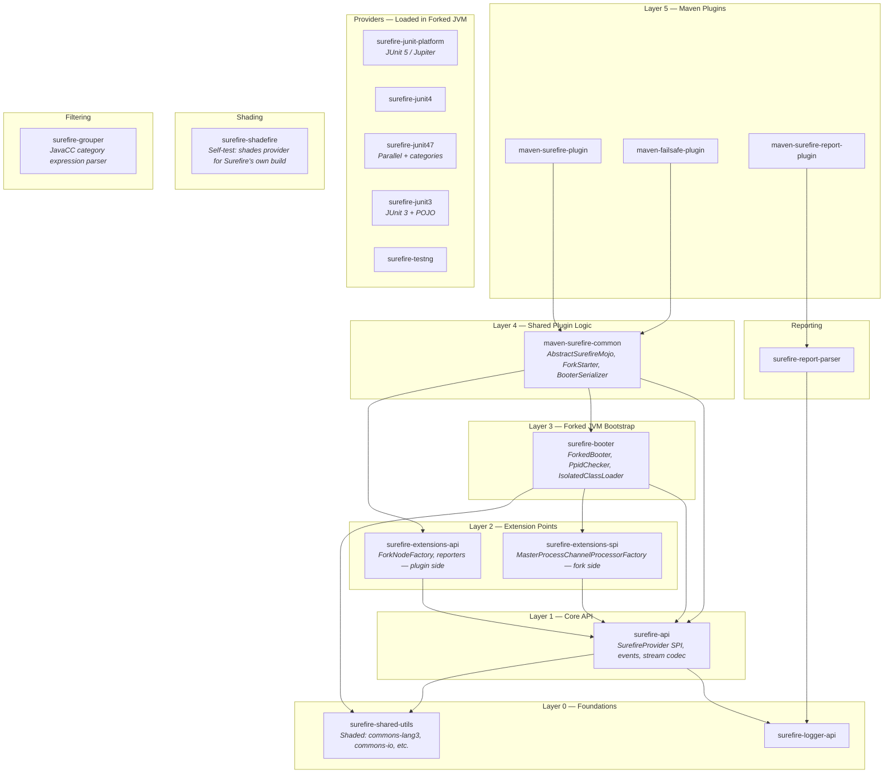
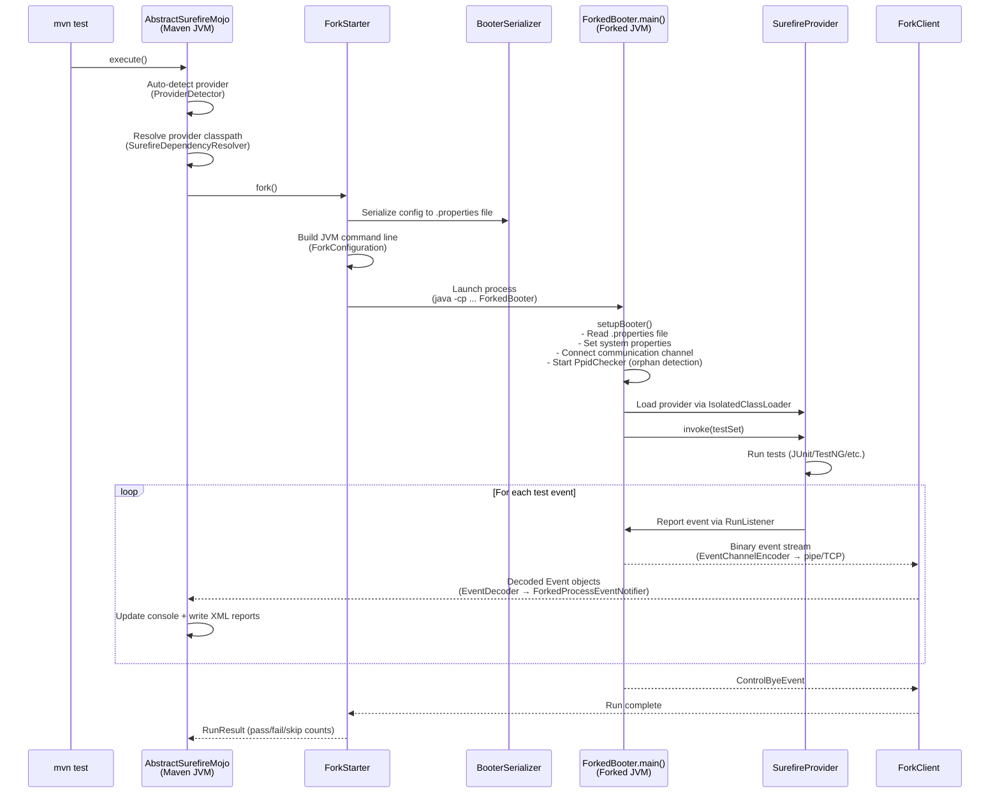
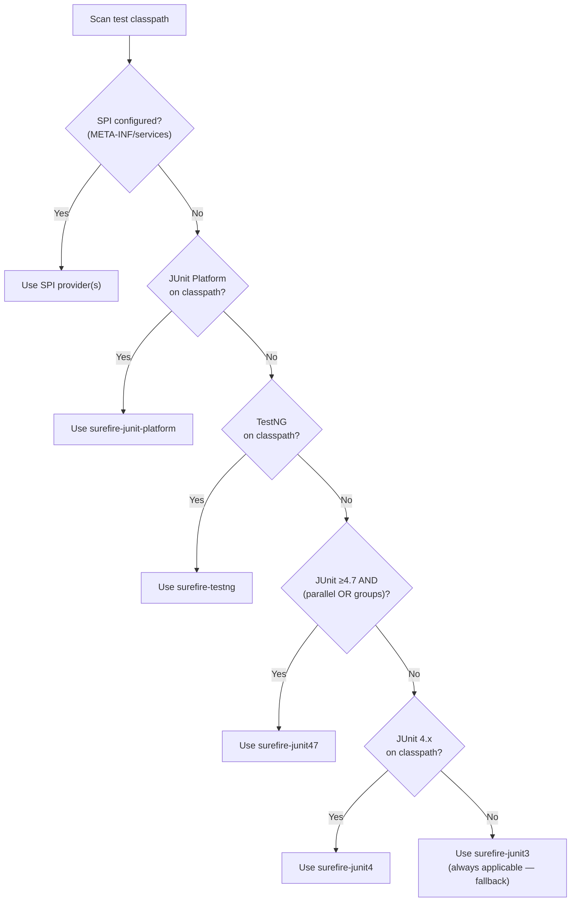
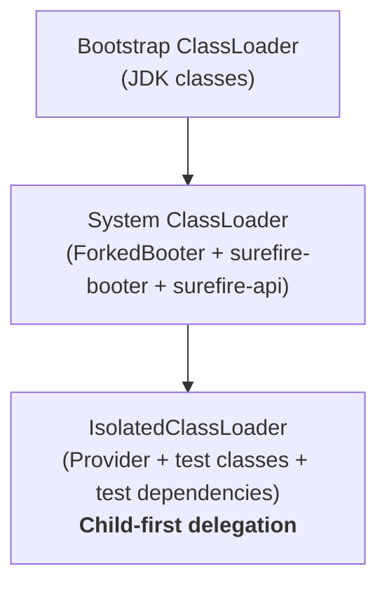

<!--
Licensed to the Apache Software Foundation (ASF) under one
or more contributor license agreements.  See the NOTICE file
distributed with this work for additional information
regarding copyright ownership.  The ASF licenses this file
to you under the Apache License, Version 2.0 (the
"License"); you may not use this file except in compliance
with the License.  You may obtain a copy of the License at

  http://www.apache.org/licenses/LICENSE-2.0

Unless required by applicable law or agreed to in writing,
software distributed under the License is distributed on an
"AS IS" BASIS, WITHOUT WARRANTIES OR CONDITIONS OF ANY
KIND, either express or implied.  See the License for the
specific language governing permissions and limitations
under the License.
-->

# Apache Maven Surefire — Architecture Overview

> Architecture reference for the `master` branch (version 3.5.x).
> For the upcoming 3.6.0 changes, see [PR #3179 — Unified JUnit Platform Provider](pr-3179-unified-provider.md).

## What is Surefire?

Apache Maven Surefire is the test execution framework for Maven. It ships three plugins:

| Plugin | Purpose |
|--------|---------|
| **maven-surefire-plugin** | Runs unit tests during the `test` phase |
| **maven-failsafe-plugin** | Runs integration tests during `integration-test` / `verify` phases |
| **maven-surefire-report-plugin** | Generates HTML test reports from XML results |

Surefire supports JUnit 3, JUnit 4, JUnit 5 (Jupiter), TestNG, and plain POJO tests — each via a dedicated **provider** module. Tests execute in a **forked JVM** that communicates results back to Maven through a binary event stream protocol.

---

## Module Map

The project is a multi-module Maven reactor with 14+ modules organized in layers.



### Key relationships

- **Both plugins** (`surefire-plugin`, `failsafe-plugin`) share all logic via `maven-surefire-common`. The failsafe plugin adds pre/post-integration-test lifecycle binding and a different default report directory.
- **Providers are not compile dependencies** of the plugins. They are resolved at runtime by `SurefireDependencyResolver` and loaded in the forked JVM's classpath.
- **`surefire-shared-utils`** shades commons-lang3, commons-io, commons-compress, and maven-shared-utils into `org.apache.maven.surefire.shared.*` to prevent version conflicts with user projects.
- **`surefire-shadefire`** shades the entire `surefire-junit-platform` provider into `org.apache.maven.shadefire.*` so Surefire can use a different version of itself to run its own unit tests during its build.

---

## Forked JVM Architecture

The most important architectural concept: **tests never run in the Maven JVM**. They execute in a separate forked process.



### Fork modes

| Mode | Behavior | Flag |
|------|----------|------|
| **forkCount=1** (default) | Single forked JVM, all test classes run sequentially | `<forkCount>1</forkCount>` |
| **forkCount=N** | N parallel forked JVMs | `<forkCount>4</forkCount>` |
| **forkCount=NC** | N × CPU cores parallel forks | `<forkCount>1C</forkCount>` |
| **reuseForks=true** (default) | Same JVM reused across test classes | `<reuseForks>true</reuseForks>` |
| **reuseForks=false** | New JVM per test class | `<reuseForks>false</reuseForks>` |

### Fork configuration variants

The command line for the forked JVM is built by one of three `ForkConfiguration` implementations:

| Class | When used | Classpath strategy |
|-------|-----------|-------------------|
| `ClasspathForkConfiguration` | Default for classpath mode | `-cp <full classpath>` |
| `JarManifestForkConfiguration` | When classpath exceeds OS limits | Creates a temp JAR with `Class-Path` manifest entry |
| `ModularClasspathForkConfiguration` | Java 9+ module path | `--module-path` + `--add-modules` |

---

## Provider Model

### SurefireProvider SPI

Every test framework adapter implements `SurefireProvider` (in `surefire-api`):

```java
public interface SurefireProvider {
    // Returns test classes/suites — determines fork granularity
    Iterable<Class<?>> getSuites();

    // Executes tests; forkTestSet is null for "run all" or a Class for per-test forking
    RunResult invoke(Object forkTestSet) throws TestSetFailedException, ReporterException;

    // Graceful cancellation on timeout
    void cancel();
}
```

### Provider implementations

| Provider | Module | Test framework | Key classes |
|----------|--------|---------------|-------------|
| **JUnit 3 + POJO** | `surefire-junit3` | JUnit 3.x, plain POJOs | `JUnit3Provider`, `PojoTestSetExecutor` |
| **JUnit 4** | `surefire-junit4` | JUnit 4.0–4.6 | `JUnit4Provider` |
| **JUnit 4.7+** | `surefire-junit47` | JUnit 4.7+ with parallel/categories | `JUnitCoreProvider`, `ParallelComputerBuilder` |
| **TestNG** | `surefire-testng` | TestNG 4.7+ | `TestNGProvider`, `TestNGExecutor` |
| **JUnit Platform** | `surefire-junit-platform` | JUnit 5, any JUnit Platform engine | `JUnitPlatformProvider`, `LauncherAdapter` |

### Auto-detection

When no provider is manually configured, Surefire scans the test classpath and selects the **first applicable** provider:



The priority order is defined in `AbstractSurefireMojo.createProviders()`. Surefire resolves the provider's dependencies at runtime via `SurefireDependencyResolver` and adds them to the forked JVM's classpath — the provider JAR is never a compile-time dependency of the plugin.

---

## Communication Protocol

The forked JVM communicates with Maven through a **binary event stream**. Events flow one-way: fork → Maven. Commands flow the other way: Maven → fork.

### Event types (fork → Maven)

The `ForkedProcessEventType` enum defines 21 opcodes:

| Category | Events |
|----------|--------|
| **Test lifecycle** | `testset-starting`, `testset-completed`, `test-starting`, `test-succeeded`, `test-failed`, `test-skipped`, `test-error`, `test-assumption-failure` |
| **Console output** | `std-out-stream`, `std-out-stream-new-line`, `std-err-stream`, `std-err-stream-new-line` |
| **Logging** | `console-info-log`, `console-debug-log`, `console-warning-log`, `console-error-log` |
| **Control** | `bye`, `stop-on-next-test`, `next-test` |
| **System** | `sys-prop`, `jvm-exit-error` |

### Wire format

Each event is encoded as: `:<magic>:<opcode>:<data>:` using `EventChannelEncoder` (fork side) and decoded by `EventDecoder` (Maven side). The encoding uses `ByteBuffer`-backed channels for efficiency.

### Transport channels

| Channel | Configuration | How it works |
|---------|--------------|-------------|
| **Pipe** (default) | `pipe://` | stdout/stderr of forked process |
| **TCP** | `tcp://host:port` | Socket connection, configured via Extensions SPI |

---

## ClassLoader Isolation

The forked JVM uses a layered classloader strategy to prevent classpath conflicts:



`IsolatedClassLoader` extends `URLClassLoader` with **child-first class loading**: it calls `findClass()` before delegating to the parent, ensuring test classes and provider classes take precedence over surefire internals.

Three classpaths are maintained:

| Classpath | Contents | Purpose |
|-----------|----------|---------|
| **surefireClasspath** | surefire-booter, surefire-api, extensions | System classloader — bootstrap |
| **testClasspath** | Test classes, test dependencies, provider | IsolatedClassLoader — test execution |
| **inprocClasspath** | Classes needed in both loaders | Bridging (e.g., `SurefireProvider` interface) |

For Java 9+, `ModularClasspathConfiguration` adds `--module-path` and `--add-reads` / `--add-opens` directives.

---

## Shading Strategy

Two modules handle classpath isolation at build time:

### surefire-shared-utils

Shades third-party libraries into the `org.apache.maven.surefire.shared` package:

| Original | Shaded to |
|----------|-----------|
| `org.apache.commons.lang3` | `org.apache.maven.surefire.shared.lang3` |
| `org.apache.commons.io` | `org.apache.maven.surefire.shared.io` |
| `org.apache.commons.compress` | `org.apache.maven.surefire.shared.compress` |
| `org.apache.maven.shared.utils` | `org.apache.maven.surefire.shared.utils` |

This prevents version conflicts when user projects depend on different versions of these libraries.

### surefire-shadefire

Shades the entire `surefire-junit-platform` provider (plus `surefire-api`, `surefire-booter`) into `org.apache.maven.shadefire.*`. This exists for one reason: **Surefire must test itself**. During the Surefire build, a different (shaded) version of the provider runs Surefire's own unit tests, avoiding conflicts with the version being compiled.

---

## Process Monitoring

The forked JVM must detect when the parent Maven process dies to avoid becoming an orphan. Two complementary mechanisms exist, configured via `ProcessCheckerType`:

### NATIVE mode (`PpidChecker`)

Periodically checks if the parent PID is still alive by running platform-specific commands:

| Platform | Command | Detection method |
|----------|---------|-----------------|
| **Linux/macOS** | `ps -o etime,pid <ppid>` | If elapsed time *decreases* between checks → PID was reused → parent is dead |
| **Windows** | PowerShell `Win32_Process` query | If creation date changes → PID was reused |

Runs on a 1-second schedule. If the parent is detected as dead → `Runtime.halt(1)`.

### PING mode

The Maven process sends periodic `NOOP` commands through the communication channel. If no command is received within 30 seconds, the forked JVM considers the parent dead and halts.

### Combined mode (`ALL`)

Both NATIVE and PING run simultaneously. Either one can trigger a halt.

---

## Extensions SPI

Surefire provides two extension points that allow customizing fork communication and reporting:

### Plugin-side extensions (`surefire-extensions-api`)

| Interface | Purpose |
|-----------|---------|
| `ForkNodeFactory` | Creates `ForkChannel` instances for fork communication |
| `ForkChannel` | Bidirectional communication channel to a forked JVM |
| `EventHandler<E>` | Processes events received from forks |
| `StatelessReporter` | Generates XML test reports |
| `ConsoleOutputReporter` | Captures console output to files |
| `StatelessTestsetInfoReporter` | Writes testset summary to console/files |

### Fork-side extensions (`surefire-extensions-spi`)

A single interface: `MasterProcessChannelProcessorFactory` — loaded via `ServiceLoader` in the forked JVM. It creates the encoder/decoder pair for communicating back to Maven. Supports `pipe://` (default) and `tcp://` transports.

---

## Reporting

Test results flow through a layered reporting pipeline:

1. **Provider** generates `ReportEntry` events (test started, succeeded, failed, etc.)
2. **`TestSetRunListener`** receives events and delegates to registered reporters
3. **`StatelessXmlReporter`** writes `TEST-*.xml` files (JUnit/Ant-compatible format)
4. **`ConsoleOutputFileReporter`** writes `*-output.txt` files with captured stdout/stderr
5. **`DefaultReporterFactory`** manages reporter lifecycle and aggregates `RunResult` across forks

When multiple forks run in parallel, each fork has its own `DefaultReporterFactory`. Results are merged by `ReportsMerger` into a single aggregate `RunResult` that determines the build status.

The `maven-surefire-report-plugin` reads the XML files (via `surefire-report-parser`) and generates HTML reports — it operates post-build and is independent of the execution pipeline.

---

## Group / Category Filtering

The `surefire-grouper` module provides test filtering by JUnit 4 categories or TestNG groups.

### How it works

1. Users configure `<groups>` and `<excludedGroups>` in the plugin configuration
2. For **JUnit 4.7+**: the `surefire-junit47` provider uses `GroupMatcherCategoryFilter` to filter tests by `@Category` annotations
3. For **TestNG**: groups are passed directly to TestNG's native group filtering
4. For **JUnit Platform**: tag filter expressions are passed to the JUnit Platform Launcher

The module includes a **JavaCC-generated parser** (`category-expression.jj`) that parses boolean expressions over group names (e.g., `"fast AND NOT slow"`), producing a `GroupMatcher` tree (`AndGroupMatcher`, `OrGroupMatcher`, `InverseGroupMatcher`, `SingleGroupMatcher`).

---

## Build and Test

```bash
# Full build with unit tests
mvn clean install

# Full build with integration tests
mvn clean install -P run-its

# Build a single module
mvn clean install -pl surefire-booter

# Run a single test
mvn test -pl surefire-booter -Dtest=ForkedBooterTest

# Run a single integration test
mvn verify -pl surefire-its -Prun-its -Dit.test=JUnit47RedirectOutputIT

# IDE setup (required before importing)
mvn install -P ide-development -f surefire-shared-utils/pom.xml
mvn compile -f surefire-grouper/pom.xml
```

**Requirements**: Maven 3.6.3+, JDK 8+ (source level 8, `animal-sniffer` enforces Java 8 API).
