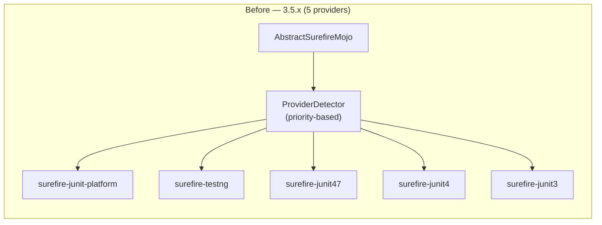
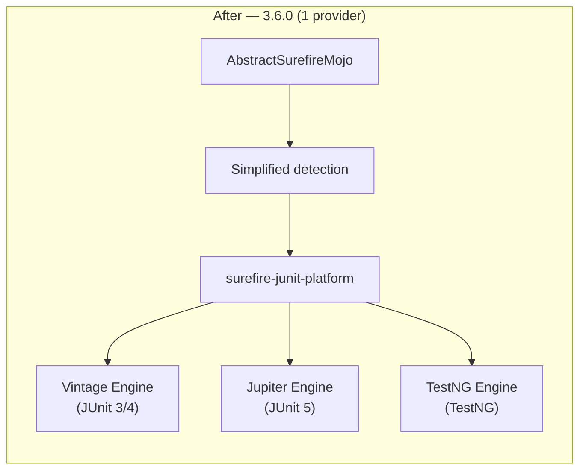

# PR #3179 — Unified JUnit Platform Provider

> Summary of changes introduced by [PR #3179](https://github.com/apache/maven-surefire/pull/3179) (`test-junit-platform-runner-junit4` → `master`).
> For the current architecture, see [architecture.md](architecture.md).

## Executive Summary

PR #3179 consolidates all test execution in Maven Surefire under a **single provider**: `surefire-junit-platform`. Instead of maintaining five separate provider implementations (JUnit 3, JUnit 4, JUnit 4.7+, TestNG, JUnit Platform), all test frameworks now run through the JUnit Platform infrastructure:

- **JUnit 4** tests (4.12+) execute via the **Vintage Engine**
- **TestNG** tests (6.14.3+) execute via the **TestNG JUnit Platform Engine**
- **JUnit 5** tests run natively via the **Jupiter Engine**

The result is a net deletion of **~26,000 lines** across 726 files, a version bump to **3.6.0-SNAPSHOT**, and a dramatically simplified provider architecture.

---

## Motivation

From the PR description:

> The main advantage will be to have **only a single implementation to maintain** as listener/reporter/launcher of test running platform. Without such change there are **5 implementations to maintain** which makes any changes extra work which doesn't help to get new contributors to help.

The five-provider architecture meant that every change to reporting, console output, parallel execution, or stream handling required updates in up to five places. This was a significant barrier to both maintenance and new feature development.

---

## What Changes for Users

### Minimum version requirements

| Framework | Before (3.5.x) | After (3.6.0) |
|-----------|----------------|---------------|
| **JUnit 3** | Supported natively | Requires JUnit 4.12+ dependency (runs via Vintage Engine) |
| **JUnit 4** | 4.0+ | **4.12+** (runs via Vintage Engine) |
| **JUnit 5** | Any | Any (unchanged) |
| **TestNG** | 4.7+ | **6.14.3+** (runs via TestNG JUnit Platform Engine) |
| **POJO tests** | Supported | **Removed** |

### JUnit 3 tests still work

JUnit 3 test code does not need to change. You only need to ensure your project depends on JUnit 4.12+ (which includes JUnit 3 API compatibility). The Vintage Engine executes JUnit 3 and JUnit 4 tests transparently.

### POJO tests removed

The `LegacyPojoStackTraceWriter` and POJO test detection (`PojoTestSetExecutor`) are removed. Tests must use a recognized framework annotation (`@Test` from JUnit or TestNG).

### Group / category filtering

The custom JavaCC-based category expression parser (`surefire-grouper`) is replaced by JUnit Platform's native **tag expression** syntax. For most users, `<groups>` and `<excludedGroups>` configuration works unchanged, but the underlying evaluation engine is different. Complex boolean expressions may need review.

### Backward compatibility options

If upgrading causes issues, users have two fallback paths:

1. **Pin Surefire 3.5.x** — stay on the previous version:
   ```xml
   <plugin>
       <groupId>org.apache.maven.plugins</groupId>
       <artifactId>maven-surefire-plugin</artifactId>
       <version>3.5.4</version>
   </plugin>
   ```

2. **Use a legacy provider as a plugin dependency** (transitional):
   ```xml
   <plugin>
       <groupId>org.apache.maven.plugins</groupId>
       <artifactId>maven-surefire-plugin</artifactId>
       <version>3.6.0</version>
       <dependencies>
           <dependency>
               <groupId>org.apache.maven.surefire</groupId>
               <artifactId>surefire-junit3</artifactId>
               <version>3.5.4</version>
           </dependency>
       </dependencies>
   </plugin>
   ```

### New feature: Stack trace filtering

A new `StackTraceProvider` optimizes memory usage by truncating stack traces to 15 frames and filtering JDK packages by default. This is configurable:

```xml
<configuration>
    <stackTraceFilterPrefixes>
        <prefix>org.springframework.</prefix>
        <prefix>org.junit.</prefix>
    </stackTraceFilterPrefixes>
</configuration>
```

---

## Architecture Changes

### Before vs. After: Provider model





The five `ProviderInfo` implementations (`JUnit3ProviderInfo`, `JUnit4ProviderInfo`, `JUnitCoreProviderInfo`, `TestNgProviderInfo`, `JUnitPlatformProviderInfo`) are collapsed into a unified detection path that always selects `surefire-junit-platform`. Framework-specific configuration (TestNG groups, JUnit 4 categories, parallel execution) is now **mapped to JUnit Platform launcher configuration** rather than being handled by framework-specific providers.

### Module-level impact

| Module | Lines changed | What changed |
|--------|--------------|-------------|
| **maven-surefire-common** | +432/−452 (source), +130/−330 (tests) | `AbstractSurefireMojo` rewritten: provider selection simplified, TestNG/JUnit4 config mapped to JUnit Platform. `ConsoleOutputFileReporter` refactored. 1 test class removed. |
| **surefire-api** | +189/−394 | `LegacyPojoStackTraceWriter` removed. `StackTraceProvider` added (memory optimization). Console output events now carry stack trace data. Stream decoder updated. |
| **surefire-grouper** | +0/−1,104 | **Gutted**: JavaCC grammar (`category-expression.jj`), `GroupMatcher` hierarchy (`And`, `Or`, `Inverse`, `Single`, `Join`), and all tests removed. Module still exists but is minimal. |
| **surefire-booter** | +48/−59 | `ForkedBooter` updated for new provider config. `PpidChecker` improvements. `EventChannelEncoder` adjusted for new stream format. |
| **maven-surefire-plugin** | +96/−169 | Site documentation rewritten for unified provider. POJO test docs removed. |
| **maven-failsafe-plugin** | +21/−26 | Aligned with surefire-plugin changes. |
| **.mvn** | +45/−12 | Build cache config added, Maven config file added. |

### Key source changes

#### `AbstractSurefireMojo` (maven-surefire-common)

The central Mojo class sees the largest logical change. The `createProviders()` method, which previously returned an array of 7 `ProviderInfo` implementations evaluated in priority order, is simplified to always select `surefire-junit-platform`. Framework detection logic (checking for JUnit 4 vs TestNG on the classpath) is replaced with configuration mapping — when TestNG is detected on the classpath, its groups/suites configuration is translated into JUnit Platform launcher discovery requests.

#### `surefire-api` event model

Standard stream events (`StandardStreamOutEvent`, etc.) gain a stack trace field via the new `StackTraceProvider`, allowing console output lines to be associated with the test class that produced them. This is the data model change that enables the memory optimization.

#### `surefire-grouper` removal

The entire JavaCC parser and `GroupMatcher` class hierarchy are deleted. The JUnit Platform has its own [tag expression](https://junit.org/junit5/docs/current/user-guide/#running-tests-tag-expressions) language that replaces this functionality. The `surefire-grouper` module is retained as a minimal shell but no longer contains the expression parser.

#### `ProviderInfo` interface

A new method is added to `ProviderInfo` to support the unified model. The interface now includes `addProviderProperties()` for passing framework-specific configuration to the JUnit Platform provider.

---

## Stack Trace Memory Optimization

### Problem

To associate console output with test classes, Surefire captures stack traces for every output line. With full stack traces (25–30 frames typical), this consumed 600–1,800 bytes per line.

### Solution

The new `StackTraceProvider` class (in `surefire-api`) introduces:

- **Frame limit**: Maximum 15 frames per stack trace (sufficient to capture the test class after surefire framework frames)
- **Package filtering**: JDK packages (`java.`, `javax.`, `sun.`, `jdk.`) filtered by default
- **Configurable prefixes**: Users can specify custom filter prefixes that **replace** (not add to) the defaults

### Memory impact

| Metric | Before | After |
|--------|--------|-------|
| Frames per trace | 25–30 | ≤15 |
| Bytes per output line | 600–1,800 | 300–600 |
| Estimated savings | — | ~50% |

### Configuration

```xml
<!-- Custom prefixes (replaces defaults) -->
<configuration>
    <stackTraceFilterPrefixes>
        <prefix>org.springframework.</prefix>
        <prefix>org.junit.</prefix>
    </stackTraceFilterPrefixes>
</configuration>
```

```bash
# Command line
mvn test -Dsurefire.stackTraceFilterPrefixes=org.springframework.,org.junit.
```

When not specified or empty, the default filters (`java.`, `javax.`, `sun.`, `jdk.`) apply.

---

## Breaking Changes

| Change | Impact | Mitigation |
|--------|--------|------------|
| **JUnit 3 standalone** no longer supported | Projects using only JUnit 3 must add JUnit 4.12+ dependency | Add `junit:junit:4.12` — test code unchanged |
| **JUnit 4 < 4.12** no longer supported | Upgrade to JUnit 4.12+ | Mechanical version bump |
| **TestNG < 6.14.3** no longer supported | Upgrade to TestNG 6.14.3+ | Mechanical version bump |
| **POJO tests** removed | Tests without framework annotations won't be found | Add `@Test` annotations |
| **Category expression syntax** changed | Complex boolean group expressions may behave differently under JUnit Platform tag expressions | Review and test group filter configurations |
| **Provider selection** changed | Manually configured legacy providers still work (via SPI) but auto-detection always chooses JUnit Platform | Pin surefire 3.5.x or add legacy provider as dependency |

---

## Community Discussion

Key points from the PR conversation:

- **Vintage Engine longevity**: The JUnit 6 release notes mark Vintage Engine as "deprecated." JUnit team member [@sormuras](https://github.com/sormuras) clarified: *"It's deprecated, but not for removal. Not slowly, not abruptly, not 'everly'."* The Vintage Engine will be maintained as long as users need it, and may eventually become a standalone project.

- **TestNG engine coverage**: TestNG contributor [@juherr](https://github.com/juherr) noted the [testng-engine](https://github.com/junit-team/testng-engine) *"does not yet cover all TestNG features and still sees relatively limited adoption."* However, they view the change positively for the Java community and are confident issues would be fixed quickly.

- **Migration approach**: The 3.6.x line will start with alpha/beta releases focused on multi-provider simplification (no new features initially). Users can always fall back to 3.5.x if issues arise.

---

## Files Changed Summary

**204 commits** | **726 files** | **+4,280 additions** | **−30,006 deletions**

| Status | Count |
|--------|-------|
| Modified | 78 |
| Removed | 17 |
| Added | 4 |
| Renamed | 1 |

### Notable removals

- `surefire-grouper/` — all GroupMatcher classes, JavaCC grammar, and tests (13 files)
- `surefire-api/` — `LegacyPojoStackTraceWriter` and its tests (2 files)
- `maven-surefire-common/` — `AbstractSurefireMojoJunitCoreProvidersInfoTest` (1 file)
- `maven-surefire-plugin/` — POJO test documentation (1 file)

### Notable additions

- `surefire-api/.../StackTraceProvider.java` — stack trace memory optimization
- `maven-surefire-common/.../surefire.junit.version.properties` — JUnit version detection resource
- `.mvn/maven-build-cache-config.xml` + `.mvn/maven.config` — build configuration
