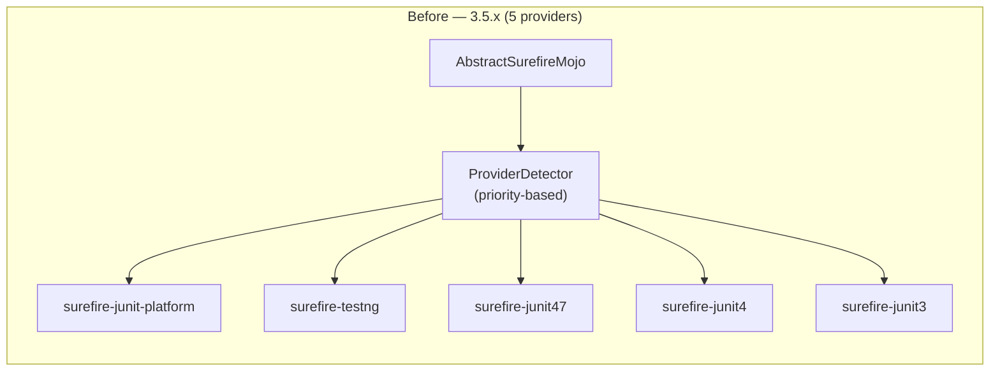
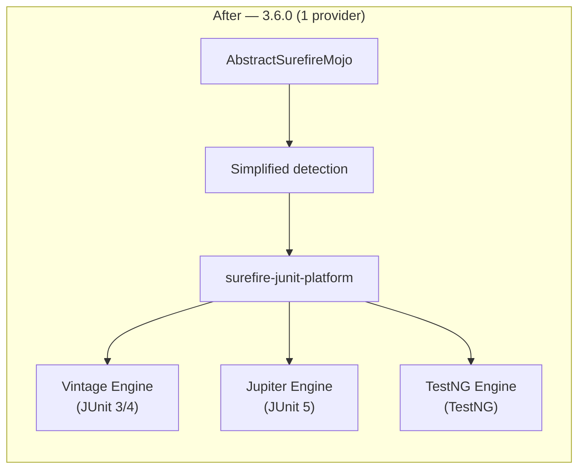

<!--
Licensed to the Apache Software Foundation (ASF) under one
or more contributor license agreements.  See the NOTICE file
distributed with this work for additional information
regarding copyright ownership.  The ASF licenses this file
to you under the Apache License, Version 2.0 (the
"License"); you may not use this file except in compliance
with the License.  You may obtain a copy of the License at

  http://www.apache.org/licenses/LICENSE-2.0

Unless required by applicable law or agreed to in writing,
software distributed under the License is distributed on an
"AS IS" BASIS, WITHOUT WARRANTIES OR CONDITIONS OF ANY
KIND, either express or implied.  See the License for the
specific language governing permissions and limitations
under the License.
-->

# Maven-Surefire 3.6.x: technical details

> This document describes changes, new features and decisions for the simplified inner structure of Surefire.
> For the current architecture, see [architecture.md](architecture.md).

## Motivation

The main advantage will be to have **only a single implementation to maintain** as listener/reporter/launcher of test running platform. Without such change there are **5 implementations to maintain** which makes any changes extra work which doesn't help to get new contributors to help.

The five-provider architecture meant that every change to reporting, console output, parallel execution, or stream handling required updates in up to five places. This was a significant barrier to both maintenance and new feature development.

---

## Executive Summary

PR #3179 consolidates all test execution in Maven Surefire under a **single provider**: `surefire-junit-platform`. Instead of maintaining five separate provider implementations (JUnit 3, JUnit 4, JUnit 4.7+, TestNG, JUnit Platform), all test frameworks now run through the JUnit Platform infrastructure:

- **JUnit 4** tests (4.12+) execute via the **Vintage Engine**
- **TestNG** tests (6.14.3+) execute via the **TestNG JUnit Platform Engine**
- **JUnit 5** tests run natively via the **Jupiter Engine**

The result is a net deletion of **~26,000 lines** across 726 files, a version bump to **3.6.0-SNAPSHOT**, and a dramatically simplified provider architecture.

---

## Breaking Changes

| Change | Impact | Mitigation |
|--------|--------|------------|
| **JUnit 3 standalone** no longer supported | Projects using only JUnit 3 must add JUnit 4.12+ dependency | Add `junit:junit:4.12` — test code unchanged |
| **JUnit 4 < 4.12** no longer supported | Upgrade to JUnit 4.12+ | Mechanical version bump |
| **TestNG < 6.14.3** no longer supported | Upgrade to TestNG 6.14.3+ | Mechanical version bump |
| **POJO tests** removed | Tests without framework annotations won't be found | Add `@Test` annotations |
| **Category expression syntax** changed | Complex boolean group expressions may behave differently under JUnit Platform tag expressions | Review and test group filter configurations |
| **Provider selection** changed | Manually configured legacy providers still work (via SPI) but auto-detection always chooses JUnit Platform | Pin surefire 3.5.x or add legacy provider as dependency |

---

## What Changes for Users

### Minimum version requirements

| Framework | Before (3.5.x) | After (3.6.0) |
|-----------|----------------|---------------|
| **JUnit 3** | Supported natively | Requires JUnit 4.12+ dependency (runs via Vintage Engine) |
| **JUnit 4** | 4.0+ | **4.12+** (runs via Vintage Engine) |
| **JUnit 5** | Any | Any (unchanged) |
| **TestNG** | 4.7+ | **6.14.3+** (runs via TestNG JUnit Platform Engine) |
| **POJO tests** | Supported | **Removed** |

### JUnit 3 tests still work

JUnit 3 test code does not need to change. You only need to ensure your project depends on JUnit 4.12+ (which includes JUnit 3 API compatibility). The Vintage Engine executes JUnit 3 and JUnit 4 tests transparently.

### POJO tests removed

The `LegacyPojoStackTraceWriter` and POJO test detection (`PojoTestSetExecutor`) are removed. Tests must use a recognized framework annotation (`@Test` from JUnit or TestNG).

### Group / category filtering

The custom JavaCC-based category expression parser (`surefire-grouper`) is replaced by JUnit Platform's native **tag expression** syntax. For most users, `<groups>` and `<excludedGroups>` configuration works unchanged, but the underlying evaluation engine is different. Complex boolean expressions may need review.

### Backward compatibility options

If upgrading causes issues, users have two fallback paths:

1. **Pin Surefire 3.5.x** — stay on the previous version:
   ```xml
   <plugin>
       <groupId>org.apache.maven.plugins</groupId>
       <artifactId>maven-surefire-plugin</artifactId>
       <version>3.5.4</version>
   </plugin>
   ```

2. **Use a legacy provider as a plugin dependency** (transitional):
   ```xml
   <plugin>
       <groupId>org.apache.maven.plugins</groupId>
       <artifactId>maven-surefire-plugin</artifactId>
       <version>3.6.0</version>
       <dependencies>
           <dependency>
               <groupId>org.apache.maven.surefire</groupId>
               <artifactId>surefire-junit3</artifactId>
               <version>3.5.4</version>
           </dependency>
       </dependencies>
   </plugin>
   ```

### New feature: Stack trace filtering

A new `StackTraceProvider` optimizes memory usage by truncating stack traces to 15 frames and filtering JDK packages by default. This is configurable:

```xml
<configuration>
    <stackTraceFilterPrefixes>
        <prefix>org.springframework.</prefix>
        <prefix>org.junit.</prefix>
    </stackTraceFilterPrefixes>
</configuration>
```

---

## Architecture Changes

### Before vs. After: Provider model





The five `ProviderInfo` implementations (`JUnit3ProviderInfo`, `JUnit4ProviderInfo`, `JUnitCoreProviderInfo`, `TestNgProviderInfo`, `JUnitPlatformProviderInfo`) are collapsed into a unified detection path that always selects `surefire-junit-platform`. Framework-specific configuration (TestNG groups, JUnit 4 categories, parallel execution) is now **mapped to JUnit Platform launcher configuration** rather than being handled by framework-specific providers.

## Stack Trace Memory Optimization

### Problem

To associate console output with test classes, Surefire captures stack traces for every output line. With full stack traces (25–30 frames typical), this consumed 600–1,800 bytes per line.

### Solution

The new `StackTraceProvider` class (in `surefire-api`) introduces:

- **Frame limit**: Maximum 15 frames per stack trace (sufficient to capture the test class after surefire framework frames)
- **Package filtering**: JDK packages (`java.`, `javax.`, `sun.`, `jdk.`) filtered by default
- **Configurable prefixes**: Users can specify custom filter prefixes that **replace** (not add to) the defaults

### Memory impact

| Metric | Before | After |
|--------|--------|-------|
| Frames per trace | 25–30 | ≤15 |
| Bytes per output line | 600–1,800 | 300–600 |
| Estimated savings | — | ~50% |

### Configuration

```xml
<!-- Custom prefixes (replaces defaults) -->
<configuration>
    <stackTraceFilterPrefixes>
        <prefix>org.springframework.</prefix>
        <prefix>org.junit.</prefix>
    </stackTraceFilterPrefixes>
</configuration>
```

```bash
# Command line
mvn test -Dsurefire.stackTraceFilterPrefixes=org.springframework.,org.junit.
```

When not specified or empty, the default filters (`java.`, `javax.`, `sun.`, `jdk.`) apply.
